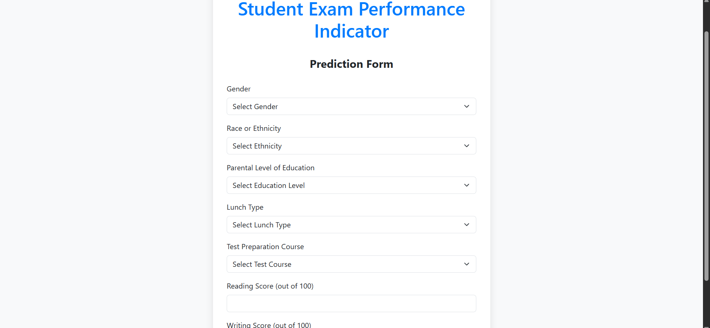

# 📚 Student Math Score Predictor — End-to-End ML App


A clean, production-style **ML project** that predicts a student’s **`math_score`** from demographics and prior scores.  
It includes reproducible data ingestion, preprocessing with `ColumnTransformer`, model selection with hyperparameter search (RF, GBDT, XGBoost, CatBoost, etc.), persisted artifacts, and a **Flask** web UI.

---

## 📸 Screenshots

> Place images in `docs/`:  
> `docs/home.png`, `docs/predict.png`, `docs/result.png`

**Home**


**Prediction Form**


**Result**


---

## ✨ Features
- Pipelines: impute → encode → scale (numeric & categorical) with `ColumnTransformer`
- Models: RandomForest, GradientBoosting, LinearRegression, XGBoost, CatBoost, AdaBoost
- Artifacts: `artifacts/preprocessor.pkl`, `artifacts/model.pkl`
- Serving: Flask UI (`/` and `/predict`)
- Prod bits: Dockerfile, `.ebextensions/` (Elastic Beanstalk), CI workflow (stub)

---

## 🧱 Tech Stack
Python 3.11, pandas, NumPy, scikit-learn, XGBoost, CatBoost, Flask, Docker, AWS EB

---

## 📂 Project Structure

```
.
├── application.py                
├── Dockerfile
├── requirements.txt
├── .ebextensions/python.config
├── artifacts/
│   ├── preprocessor.pkl
│   └── model.pkl
├── notebook/
├── src/
│   ├── components/
│   ├── pipeline/
│   ├── utils.py  ├── logger.py  ├── exception.py
└── templates/
    ├── index.html
    └── home.html
```

---

## 🧠 How It Works

1. **Ingestion** → loads `notebook/data/stud.csv`, writes raw/train/test to `artifacts/`.
2. **Transformation** → builds a `ColumnTransformer`:
   - Numeric: `SimpleImputer(median)` → `StandardScaler`
   - Categorical: `SimpleImputer(most_frequent)` → `OneHotEncoder` → `StandardScaler(with_mean=False)`
   - Persists `preprocessor.pkl`
3. **Modeling** → trains multiple regressors with param grids, selects best by R², saves `model.pkl`.
4. **Serving** → Flask loads artifacts; `/predict` takes form inputs and returns a predicted `math_score`.

---

## 🧪 Run Locally (venv)

> Windows PowerShell

```powershell
# 1) Clone
git clone https://github.com/srujan2031/Ml_project_Data_Science.git
cd Ml_project_Data_Science

# 2) Virtual env
py -m venv .venv
.\.venv\Scripts\Activate.ps1

# 3) Install deps
python -m pip install --upgrade pip setuptools wheel
pip install -r requirements.txt

# 4) (Optional) Re-train to regenerate artifacts
python - <<'PY'
from src.components.data_ingestion import DataIngestion
from src.components.data_transformation import DataTransformation
from src.components.model_trainer import ModelTrainer
ing = DataIngestion()
train_csv, test_csv = ing.initiate_data_ingestion()
tr = DataTransformation()
train_arr, test_arr, _ = tr.initiate_data_transformation(train_csv, test_csv)
mt = ModelTrainer()
name, r2 = mt.initiate_model_trainer(train_arr, test_arr)
print(f"Best model: {name}, R2: {r2:.4f}")
PY

# 5) Run the app
python application.py
# Open: http://localhost:5000 (→ /predict)
```

> macOS/Linux: use `python3 -m venv .venv && source .venv/bin/activate` instead of the PowerShell activate line.

---

## 🐳 Run with Docker Hub

> If your image is on Docker Hub (e.g., `srujanchinta/ml_project_data_science:latest`):

```bash
docker pull srujanchinta/ml_project_data_science:latest
docker run -p 5000:5000 srujanchinta/ml_project_data_science:latest
# http://localhost:5000
```

Run in background (optional):

```bash
docker run -d --name student-app -p 5000:5000 srujanchinta/ml_project_data_science:latest
docker logs -f student-app
```

---

## 🔌 API / Programmatic Use

```python
import pandas as pd
from src.pipeline.predict_pipeline import PredictPipeline

pp = PredictPipeline()
row = pd.DataFrame([{
  "gender": "male",
  "race_ethnicity": "group B",
  "parental_level_of_education": "bachelor's degree",
  "lunch": "standard",
  "test_preparation_course": "none",
  "reading_score": 72.0,
  "writing_score": 70.0,
}])
pred = pp.predict(row)
print(float(pred[0]))
```

---

## 🧭 Roadmap
- [ ] Add unit tests
- [ ] Pre-commit hooks + CI
- [ ] Deploy public demo
- [ ] Add `/predict/json` endpoint
- [ ] Add SHAP explainability notebook

---

## 📝 License
MIT — see `LICENSE`.

---

## 🙌 Acknowledgments
Built for learning and portfolio demonstration.
